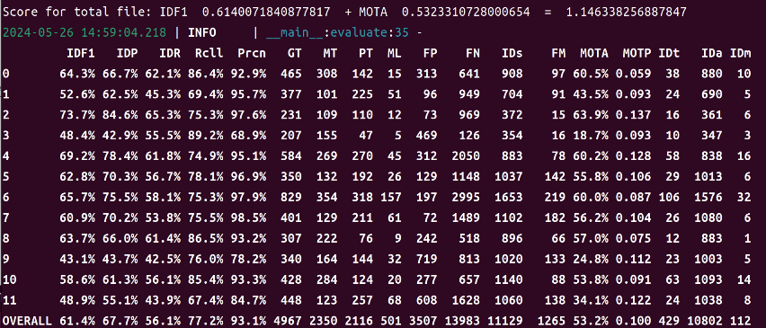

# Installation
**The code was tested on Ubuntu 22.04**

 1. Create Conda environment and install pytorch.
```shell
conda create -n botsort python=3.7
conda activate botsort
```

 2. Install torch and matched torchvision
for this code use following version
```shell
pip install torch==1.13.1+cu117 torchvision==0.14.1+cu117 torchaudio==0.13.1 --extra-index-url https://download.pytorch.org/whl/cu117
```

 3. Download this Repository to your Computer
```shell
git clone https://github.com/john92803/AI_CUP_Result
cd AI_CUP_Result
export  PYTHONPATH=${PYTHONPATH}:"."
echo ${PYTHONPATH}
```

 4. Install numpy 
```shell
pip install numpy
```

 5. Install `requirements.txt`
```shell
pip install -r requirements.txt
```

 6. Install `requirements.txt` for yolov9
```shell
pip install -r yolov9/requirements.txt
```

 7. Install `cython`
```shell
pip install cython
```

 8. Install others
```shell
# Cython-bbox
pip install cython_bbox

# faiss cpu / gpu
pip install faiss-cpu
pip install faiss-gpu
```

## Data Preparation
Download the AI_CUP dataset and create a new Folder
put the dataset into new Folder
```shell
mkdir data
```
the structure will be like:
```shell
├──data
│  ├──train
│  │  ├──images
│  │  │  ├── 0902_150000_151900
│  │  │  ├──..........
│  │  ├──labels
│  │  │  ├── 0902_150000_151900
│  │  │  ├──..........
```
### Prepare ReID Dataset

For training the ReID, detection patches must be generated as follows:   

```shell
python fast_reid/datasets/generate_AICUP_patches.py --data_path data/train
```

### Prepare YOLOv9 Dataset
```shell
python yolov7/tools/AICUP_to_YOLOv7.py --AICUP_dir data/train --YOLOv7_dir datasets/AI_CUP_MCMOT_dataset/yolo
```
There will have a new floder:datasets
there's yolo format dataset in `datasets`

## Training (Fine-tuning)
### Train ReID Module 

```shell
python3 fast_reid/tools/train_net.py --config-file fast_reid/configs/AICUP/bagtricks_R50-ibn.yml MODEL.DEVICE "cuda:0"
```
You can change batchsize in `fast_reid/configs/AICUP/bagtricks_R50-ibn.yml`
If you see MoudleNotFoundError: No moudle named 'fast_reid.fastreid.evaluation.rank_cylib.rank_cy', it mean done for Re-ID training

### Fine-tune YOLOv9
```shell
cd yolov9
```
Download yolov9 pretrained weight `yolov9-e.pt`

```shell
wget https://github.com/WongKinYiu/yolov9/releases/download/v0.1/yolov9-e.pt
```

**important**
you need to change path config in yolov9/dataset/coco.yaml !!!!!!!!!!
e.x. path: /home/AI_CUP_Result/datasets/AI_CUP_MCMOT_dataset/yolo

```shell
python train_dual.py --workers 8 --device 0 --batch 16 --data dataset/coco.yaml --img 1280 --cfg dataset/yolov9-e.yaml --weights yolov9-e.pt --name yolov9-e --hyp hyp.scratch-high.yaml --min-items 0 --epochs 50 --close-mosaic 1
```
your output weight will in yolov9/runs/yolov9-e/weight/best.pt

## Tracking and creating the submission file for yolov9

You should change `--weights` and `--fast-reid-weights` with your own path
```shell
cd <AI_CUP_Result>
bash tools/track_all_timestamps.sh --weights "" --source-dir "data/train/images" --device "0" --fast-reid-config "fast_reid/configs/AICUP/bagtricks_R50-ibn.yml" --fast-reid-weights "logs/AICUP/bagtricks_R50-ibn/model_00xx.pth"
```

result will save in `runs/detect`

## Evaluate

You need to run `tools/datasets/AICUP_to_MOT15.py` to convert ground truth into submission format
```bash
python tools/datasets/AICUP_to_MOT15.py --AICUP_dir "data/train" --MOT15_dir "/runs/MOT15" 
```

Copy result txt(check your source folder and destination folder in `copy_result.py`) 
```bash
python copy_result.py
```

run `tools/evaluate.py` to score your submission
There's 12 .txt file in --gt_dir and --ts_dir
```bash
python tools/evaluate.py --gt_dir "/runs/MOT15" --ts_dir "yolov9_res"
```

Then you can get the result:

## Citation

```
@article{aharon2022bot,
  title={BoT-SORT: Robust Associations Multi-Pedestrian Tracking},
  author={Aharon, Nir and Orfaig, Roy and Bobrovsky, Ben-Zion},
  journal={arXiv preprint arXiv:2206.14651},
  year={2022}
}
```


## Acknowledgement

A large part of the codes, ideas and results are borrowed from
- [BoT-SORT](https://github.com/NirAharon/BoT-SORT)
- [AI_CUP](https://github.com/ricky-696/AICUP_Baseline_BoT-SORT)
- [ByteTrack](https://github.com/ifzhang/ByteTrack)
- [StrongSORT](https://github.com/dyhBUPT/StrongSORT)
- [FastReID](https://github.com/JDAI-CV/fast-reid)
- [YOLOX](https://github.com/Megvii-BaseDetection/YOLOX)
- [YOLOv7](https://github.com/wongkinyiu/yolov7)
- [YOLOv9](https://github.com/WongKinYiu/yolov9)


